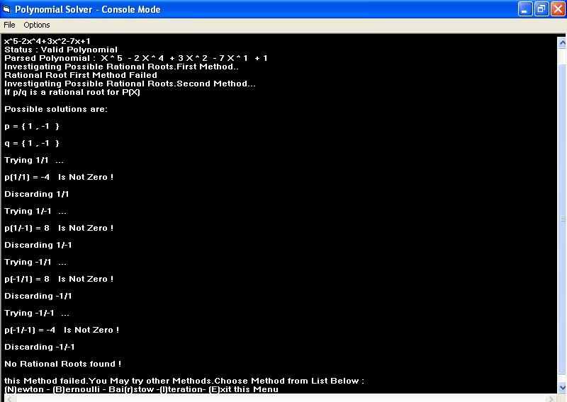



## Powerfull Polynomial Solver

### Description

A console based polynomial solver capable to factorize polynomials of High degrees.It includes a validator and parser to detect coefficients and degrees.It uses different strategies for solving depending on the Nature of polynomial.

Beside the default solving method (Rational roots),It uses the following powerfull Numeric Methods : Newton, Bernouill,Bairstow,Iterative.

Enjoy !
 
### More Info
 

             |
---                |---
**Submitted On**   |2004-08-26 22:23:52
**By**             |[E\.othman](https://github.com/Planet-Source-Code/PSCIndex/blob/master/ByAuthor/e-othman.md)
**Level**          |Intermediate
**User Rating**    |4.9 (44 globes from 9 users)
**Compatibility**  |VB 5\.0, VB 6\.0
**Category**       |[Math/ Dates](https://github.com/Planet-Source-Code/PSCIndex/blob/master/ByCategory/math-dates__1-37.md)
**World**          |[Visual Basic](https://github.com/Planet-Source-Code/PSCIndex/blob/master/ByWorld/visual-basic.md)
**Archive File**   |[Powerfull\_189869682005\.zip](https://github.com/Planet-Source-Code/e-othman-powerfull-polynomial-solver__1-60995/archive/master.zip)

